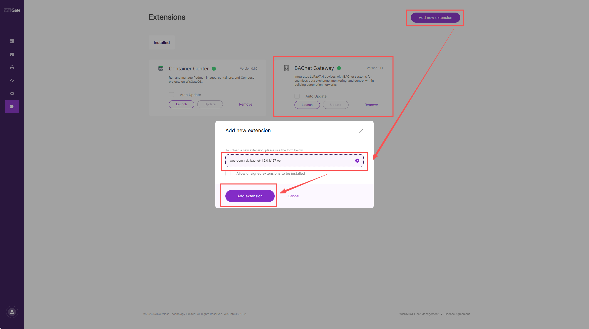

# BACnet Gateway — Firmware Releases

This directory contains firmware packages and upgrade documentation for the **BACnet Gateway** extension on RAK WisGate gateways.

---

## Compatibility

| Version | Base WisGateOS | Package |
|---------|----------------|---------|
| 1.1.0 | [WisGateOS 2.3.0](https://docs.rakwireless.com/release-notes/wisgateos2-ipq/2026/v2.3.0/) | [wes-com_rak_bacnet-1.1.0.wei](wes-com_rak_bacnet-1.1.0.wei) |
| 1.1.1 | [WisGateOS 2.3.0](https://docs.rakwireless.com/release-notes/wisgateos2-ipq/2026/v2.3.0/) | [wes-com_rak_bacnet-1.1.1.wei](wes-com_rak_bacnet-1.1.1.wei) |
| 1.2.0 | [WisGateOS 2.3.2](https://docs.rakwireless.com/release-notes/wisgateos2-ipq/2026/v2.3.2/) | [wes-com_rak_bacnet-1.2.0.wei](wes-com_rak_bacnet-1.2.0.wei) |

> **Note:** Version 1.2.0 requires WisGateOS 2.3.2. Do not install it on WisGateOS 2.3.0.

---

## Changelog

### v1.2.0

**Base OS:** [WisGateOS 2.3.2](https://docs.rakwireless.com/release-notes/wisgateos2-ipq/2026/v2.3.2/)

- **Profile management** — edit, delete, and roll back profiles; hot-update support.
- **Backup & restore** — back up and restore BACnet plugin configuration data.

### v1.1.1

**Base OS:** [WisGateOS 2.3.0](https://docs.rakwireless.com/release-notes/wisgateos2-ipq/2026/v2.3.0/)

- Bug fixes over v1.1.0; all other functionality is unchanged.

### v1.1.0

**Base OS:** [WisGateOS 2.3.0](https://docs.rakwireless.com/release-notes/wisgateos2-ipq/2026/v2.3.0/)

- Initial release of the BACnet Gateway extension.
- Supports adding LoRaWAN devices to the BACnet plugin with core integration features.

---

## Upgrading to v1.2.0

Version 1.2.0 requires **WisGateOS 2.3.2**. Complete the upgrade in two steps:

**Step 1 — Upgrade WisGateOS**

Update the gateway OS to [WisGateOS 2.3.2](https://docs.rakwireless.com/release-notes/wisgateos2-ipq/2026/v2.3.2/) before proceeding.

**Step 2 — Overwrite upgrade the BACnet extension**

1. Open **Extensions** in the WisGate web UI.
2. Click **Add new extension**.
3. Upload [`wes-com_rak_bacnet-1.2.0.wei`](wes-com_rak_bacnet-1.2.0.wei).
4. Click **Add extension** to overwrite the existing installation.

The installed version should display **1.2.0** after a successful upgrade.

